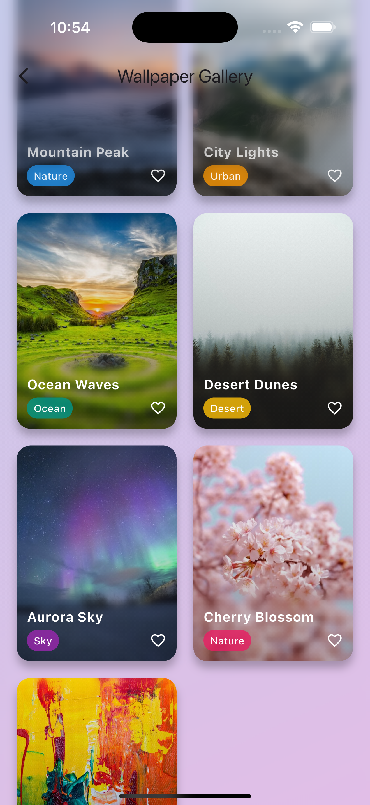
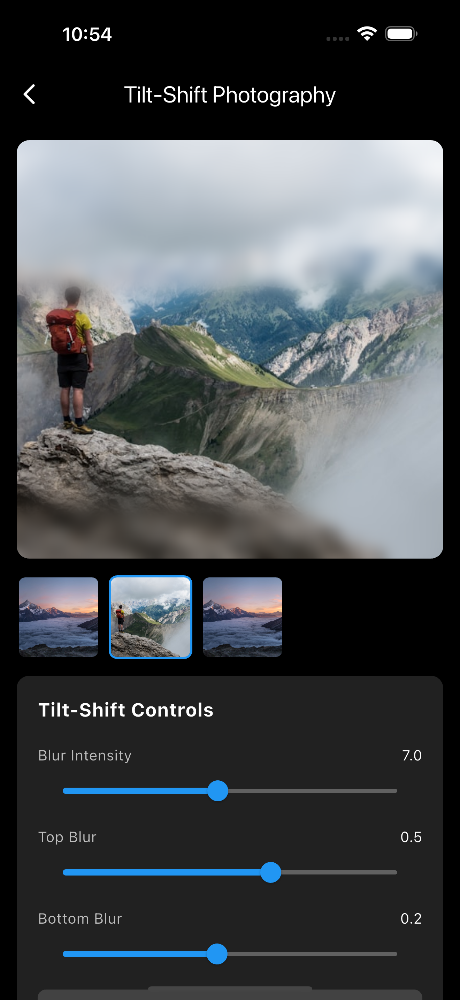
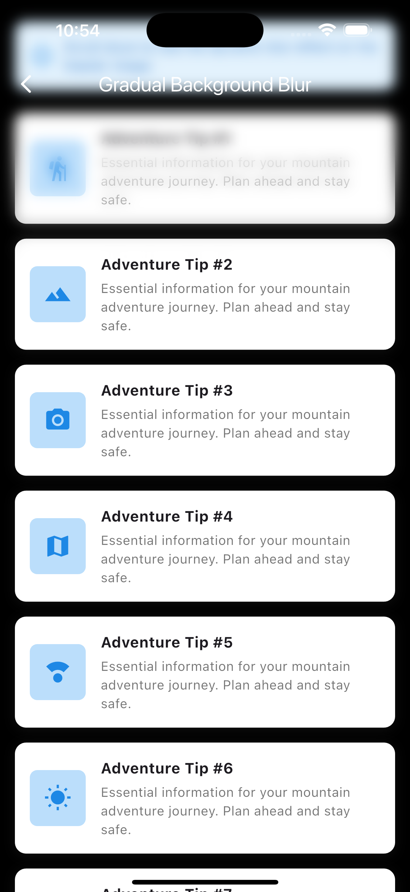
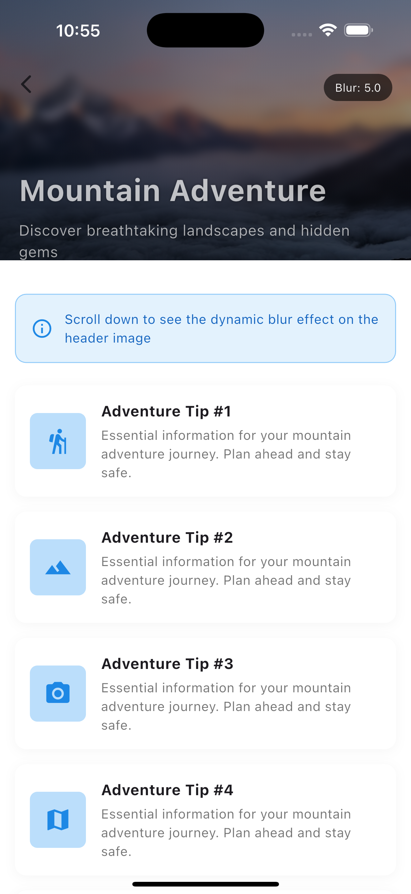
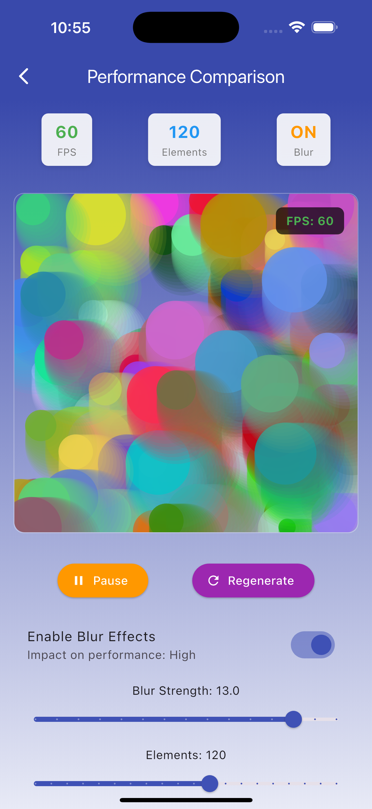

# Variable Blur

A Flutter package that provides customizable blur effects including tilt-shift blur for creating depth-of-field and variable blur effects in your Flutter applications.

## Screenshots

| Example 1 | Example 2 | Example 3 (blur with scroll) |
|-------------------|-----------------|---------------|
|  |  |  |

| Example 4 (Blurred Header) | Performance comparison |
|-------------------|----------------|
|  |  |

## Features

- **Variable Blur Effects**: Apply blur effects with different intensities on different sides of a widget
- **Tilt-Shift Blur**: Create professional depth-of-field effects similar to tilt-shift photography
- **Customizable Blur Sides**: Control blur intensity independently on top, bottom, left, and right sides
- **Performance Optimized**: Uses GPU shaders for smooth, high-performance blur rendering
- **Quality Control**: Adjustable quality settings for performance optimization

## Getting started

Add this package to your `pubspec.yaml`:

```yaml
dependencies:
  variable_blur: ^0.1.0
```

Then run:

```bash
flutter pub get
```

Import the package in your Dart code:

```dart
import 'package:variable_blur/variable_blur.dart';
```

## Usage

### Basic Variable Blur

Wrap any widget with `VariableBlur` to apply customizable blur effects:

```dart
VariableBlur(
  sigma: 5.0,
  blurSides: BlurSides.horizontal(left: 1.0, right: 1.0),
  child: Container(
    width: 200,
    height: 200,
    decoration: BoxDecoration(
      image: DecorationImage(
        image: AssetImage('assets/your_image.jpg'),
        fit: BoxFit.cover,
      ),
    ),
  ),
)
```

### Tilt-Shift Photography Effect

Create a tilt-shift blur effect for depth-of-field photography:

```dart
VariableBlur(
  sigma: 8.0,
  blurSides: BlurSides.vertical(top: 1.0, bottom: 1.0),
  quality: BlurQuality.high,
  child: Image.asset('assets/landscape.jpg'),
)
```

### Dynamic Scroll-Based Blur

Create dynamic blur effects that respond to user interactions:

```dart
class ScrollBlurExample extends StatefulWidget {
  @override
  _ScrollBlurExampleState createState() => _ScrollBlurExampleState();
}

class _ScrollBlurExampleState extends State<ScrollBlurExample> {
  double blurSigma = 0.0;
  final ScrollController _scrollController = ScrollController();

  @override
  void initState() {
    super.initState();
    _scrollController.addListener(_onScroll);
  }

  void _onScroll() {
    const maxBlur = 8.0;
    const scrollThreshold = 200.0;

    setState(() {
      blurSigma = maxBlur * (_scrollController.offset / scrollThreshold).clamp(0.0, 1.0);
    });
  }

  @override
  Widget build(BuildContext context) {
    return CustomScrollView(
      controller: _scrollController,
      slivers: [
        SliverAppBar(
          expandedHeight: 300,
          flexibleSpace: VariableBlur(
            sigma: blurSigma,
            blurSides: BlurSides.vertical(bottom: 1.0),
            child: FlexibleSpaceBar(
              background: Image.asset('assets/header_image.jpg', fit: BoxFit.cover),
            ),
          ),
        ),
        // Your scrollable content here
      ],
    );
  }
}
```

### Blur Sides Configuration

Control blur intensity on different sides:

```dart
// Horizontal blur only (ratio-based: 0.0 to 1.0)
BlurSides.horizontal(left: 0.5, right: 0.8)

// Vertical blur only (ratio-based: 0.0 to 1.0)
BlurSides.vertical(top: 1.0, bottom: 0.3)

// Pixel-based blur (absolute values in pixels)
ResponsiveBlurSides.horizontal(left: 20.0, right: 40.0)
ResponsiveBlurSides.vertical(top: 50.0, bottom: 30.0)
```

#### BlurSides vs ResponsiveBlurSides

**BlurSides** - Ratio-based blur regions (0.0 to 1.0):
- Values are percentages of child's width/height
- Automatically adapts to different widget sizes
- Perfect for responsive layouts

**ResponsiveBlurSides** - Pixel-based blur regions:
- Values are absolute pixels
- Fixed blur distances regardless of widget size
- Ideal for consistent visual effects

```dart
// 20% of child's height from top
BlurSides.vertical(top: 0.2, bottom: 0.0)

// Exactly 50 pixels from top
ResponsiveBlurSides.vertical(top: 50.0, bottom: 0.0)
```

## API Reference

### VariableBlur

The main widget for applying variable blur effects.

| Parameter      | Type          | Default            | Description                                            |
| -------------- | ------------- | ------------------ | ------------------------------------------------------ |
| `child`        | `Widget`      | required           | The widget to apply blur effects to                    |
| `sigma`        | `double`      | required           | The blur intensity (0.0 = no blur, higher = more blur) |
| `blurSides`    | `BlurSides`   | required           | Configuration for which sides to blur                  |
| `quality`      | `BlurQuality` | `BlurQuality.high` | Quality setting for performance optimization           |
| `edgeIntensity`| `double`      | `0.15`             | Controls smoothness of blur transitions (0.0 to 1.0)  |
| `isYFlipNeed`  | `bool`        | `false`            | Whether to flip Y-axis for Android compatibility       |

### BlurQuality

Enum for controlling blur quality vs performance:

- `BlurQuality.low` - Faster rendering, lower quality
- `BlurQuality.medium` - Balanced quality and performance
- `BlurQuality.high` - Best quality, slower rendering

## Performance Tips

1. **Use appropriate quality settings**: Lower quality settings for animations, higher for static effects
2. **Recommended sigma range**: 8-15 for best performance and visual quality
3. **Precache shaders**: Use `VariableBlur.precacheShaders()` in your app's main function to eliminate first-render stutter
4. **Android compatibility**: Set `isYFlipNeed: Platform.isAndroid` for consistent cross-platform behavior

## Shader Precaching

For smooth performance from the first frame:

```dart
import 'package:flutter/material.dart';
import 'package:variable_blur/variable_blur.dart';

void main() async {
  WidgetsFlutterBinding.ensureInitialized();
  
  // Precache shaders during app startup
  await VariableBlur.precacheShaders();
  
  runApp(MyApp());
}
```

## Examples

Run the example app:

```bash
cd example
flutter run
```

## Troubleshooting

**Blur effects not visible?**
- Ensure your child widget has visible pixels (background color, image, etc.)
- Check that sigma > 0 and blur sides values > 0.0

**Performance issues?**
- Use `BlurQuality.low` or `BlurQuality.medium`
- Reduce sigma values (try 8-12 instead of 15+)
- Use shader precaching for smooth animations

**Android compatibility issues?**
- Set `isYFlipNeed: Platform.isAndroid`

For more detailed troubleshooting and advanced usage, check the [example folder](example/) and [documentation](https://pub.dev/packages/variable_blur).
